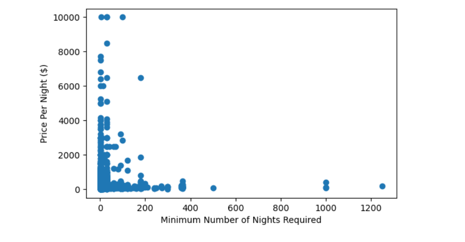

# AIRBNBS IN MANHATTAN

## Demographics & Statistics  
According to NYC 2020 census, Manhattan has a population of 1,632,480 people and a population density of 70,826 people per square mile. Although Manhattan is the smallest borough in terms of land area, it is the most densely populated. For the racial composition, there are about 58.9% white, 50.7% Non-Hispanic White, 10.3% Asian and 15.5% Black or African American.  
  

New York City’s population is projected to surpass 9 million by 2050, with the fastest rate of growth in the Bronx and Brooklyn.
  

## Observations of Mahanttan AirBnB Listings  
For our group, the qualities that make a neighborhood a desirable place to live in are safety or low crime, affordability, access to transportation, convenient location, good public schools, more jobs, and access to other amenities (restaurants, parks, gyms, grocery stores, etc.). The three most important qualities for us are safety, affordability, and convenient location. We consider these three qualities to be the most essential because when choosing a neighborhood to live in, you want to feel safe in your home and walking around your neighborhood; you want to be able to comfortably afford your rent every month; and you want your apartment to be in a convenient location in terms of having easy access to transportation and a short commute time to work or other places around the city.   

## AirBnB Statistics in Manhattan  

_Exhibit 1: NUMBER OF LISTINGS_

###### The number of listings in all boroughs is 48895. The number of listings in Manhattan is 21661

Almost half of the listings in all boroughs are in Manhattan (44%). This shows that Manhattan is a highly desirable area to live in, and according to our report in HC3, this is due to it having a vibrant lifestyle full of activities and jobs available to people of all ages.  

_Exhibit 2: AVERAGE PRICE PER BOROUGH_

  

Manhattan has by far the highest average price of airbnb listings with an average price of almost $200 per day. Manhattan’s average price is 2 times larger than Queens and Bronx and almost 1.75 times larger than Brooklyn and Staten Island. Brooklyn has the second highest average price of airbnb listings. Then in third, fourth and fifth it goes Staten Island, Queens Bronx respectively. Looking at our individual neighborhoods in Manhattan, Chinatown has an average price of $160. East Harlem has an average price of $135. East Village has an average price of $180. West Village has an average price of $265. Both East and West Village significantly bring up Manhattan's average price. There is no clear trend between minimum number of nights required to book a listing and price of Airbnb listings across Manhattan: most of the data stayed close to the origin (low price and few number of nights required), but there were a few outliers where a high minimum number of nights (three outliers with 1000+ nights) is associated with a low price per night or a small minimum number of nights is associated with an astronomical price (three outliers with $10,000 per night)

_Exhibit 3: AVERAGE PRICE IN ALL MANHATTAN NEIGHBORHOODS_

  
Across all neighborhoods, Tribeca has, by far, the highest average price per night at almost $500 a night. The next highest is Battery Park City at $360 a night, followed by the Financial District at $350 a night. The lowest average price per night positions are taken by Inwood and Washington Heights, which both have an average of $100 a night. This reflects our borough average of $200 a night well, as there is a wide range of prices across all neighborhoods but most range from $150 - $250 a night.  

_Exhibit 4: ROOM TYPE PER LISTING IN MANHATTAN_

In Manhattan, most of the airbnbs offered are entire houses or apartments. In fact, almost two thirds of all listings offered are entire homes/apts. Over a third of listings offered are private rooms and just 2.2% are shared rooms. We can surmise that this is due to Manhattan being a prime vacation location where tenants are more likely willing to stay in a private, open space without having to see their landlord. It would be a nice family-friendly apartment with space available to cook or relax. The private rooms are more likely to be rented by individuals who are travelling alone. The shared rooms are very few but may be more budget friendly or desirable to those wanting to meet new people. In the context of the COVID-19 pandemic, room type may also be considered a safety feature, as travelers might prefer to stay in an Airbnb that is an entire home/apt or at least a private room, rather than a shared room, in order to maintain social distance. 

_Exhibit 5: AVERAGE PRICE IN OUR NEIGHBORHOODS_

Only one of our neighbourhoods exceeds the neighbourhood average, and that is West Village, which has a nightly average of about $265. East Village takes the second highest spot at $186 a night. Chinatown is third at $160 a night, and East Harlem is least expensive at about $135 a month. This aligns closely with our own rankings for neighborhood desirability in HC3, in which we rated West Village and East Village as highly desirable, Chinatown as next desirable, and East Harlem as comparatively least desirable. 

_Exhibit 6: AVERAGE NUMBER OF MINIMUM NIGHTS IN OUR NEIGHBORHOODS_

West Village has the highest average number of minimum nights, with about 7.9. East Village follows at 6.5 minimum nights, and East Harlem and China are very close to each other, but East Harlem leads with 5.9 minimum nights and Chinatown with 5.8 minimum nights. Minimum nights is very important because the longer the client stays in the space, the more money they have to pay and the higher the profit. It can also indicate how lively the neighborhood the apartment is located in. If it is meant for overnight breaks, one minimum night would suffice. But if it is good for a long-term vacation stay, the minimum nights will increase. 

_Exhibit 7: AVERAGE NUMBER OF REVIEWS PER MONTH PER BOROUGH_

The highest average number of reviews are for airbnbs in Queens, where it draws in about 1.9 reviews per month. Next is Staten Island, which draws in about 1.83 reviews month, followed closely by the Bronx, with 1.80 reviews per month. Brooklyn has the fourth lease reviews per month, with 1.3, and Manhattan has the least, with 1.23 reviews per month. The number of reviews per month can indicate how long a tenant stays in the airbnb. The longer the stay, the fewer the reviews since not as many groups can book the airbnb in a period of time. 

_Exhibit 8: AVERAGE NUMBER OF REVIEWS PER MONTH IN ALL MANHATTAN NEIGHBORHOODS_

The average number of reviews for all neighborhoods is highest in the theater district, with 2.7 reviews per month, followed by Tribeca, Hell’s Kitchen, and East Village, respectively. From this data, we can see that the places with higher rents, such as Tribeca and East Village, also have more reviews per month on average than other neighborhoods. 

_Exhibit 9: AVERAGE NUMBER OF REVIEWS PER MONTH IN OUR NEIGHBORHOODS_

Although we designated the lowest rating of desirability to East Harlem, it has the highest average number of reviews per month, at 1.4. It is followed by Chinatown, with 1.15 reviews per month, East Village with .9 reviews per month, and lastly, West Village, with .7 reviews per month. This correlates directly with the average number of minimum nights. For example, because West Village requires the highest number of minimum nights, it also has the lowest average number of reviews because there are fewer tenants per month. 

_Exhibit 10: MINIMUM NUMBER OF NIGHTS AND PRICE IN ALL MANHATTAN NEIGHBORHOODS_

There is no clear trend between minimum number of nights required to book a listing and price of Airbnb listings across Manhattan: most of the data stayed close to the origin (low price and few number of nights required), but there were a few outliers where a high minimum number of nights (three outliers with 1000+ nights) is associated with a low price per night or a small minimum number of nights is associated with an astronomical price (three outliers with $10,000 per night)

## Individual Webpages 
Dorothy Liu: https://doroliu.github.io/Ctown/  
Eli Feldman: https://efeldman36.github.io/West-Village/  
Anling Chen: https://anling5chen22.github.io/east-village/
